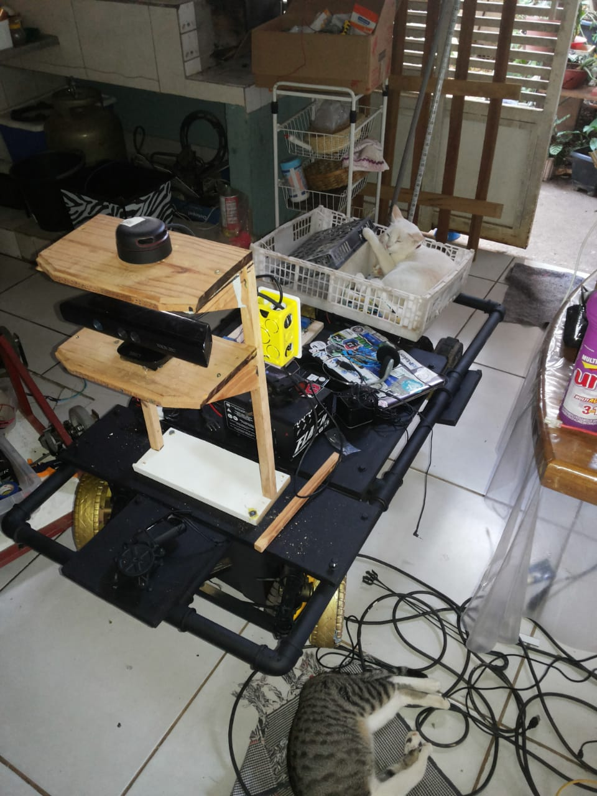
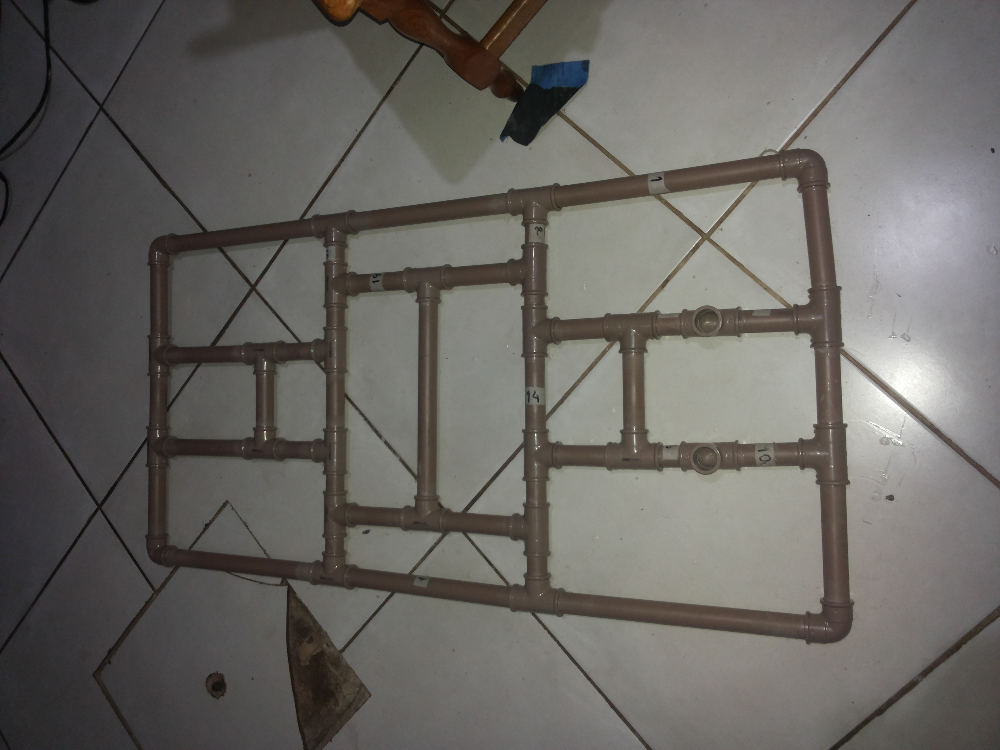
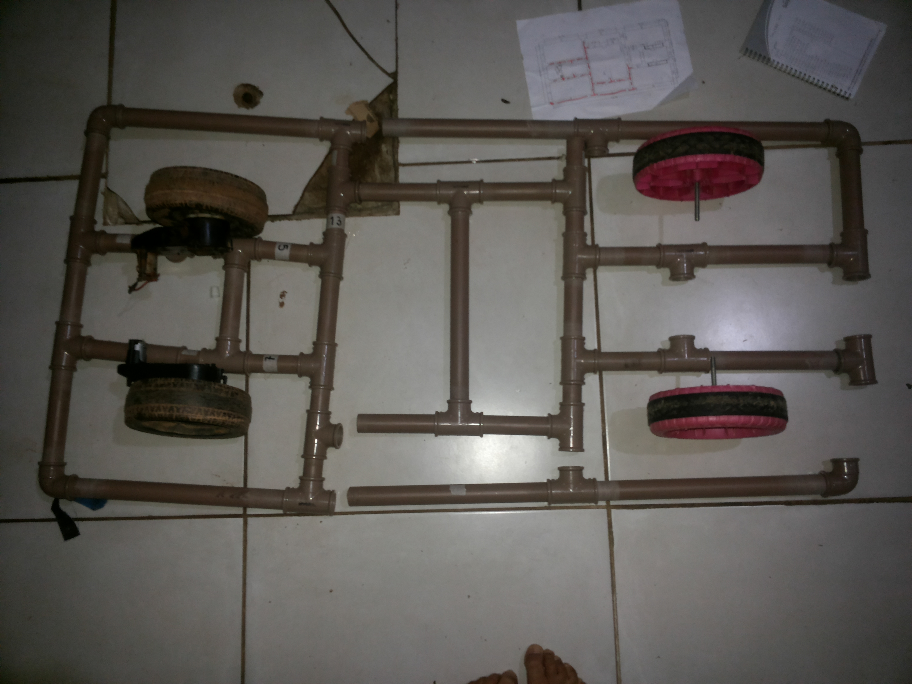
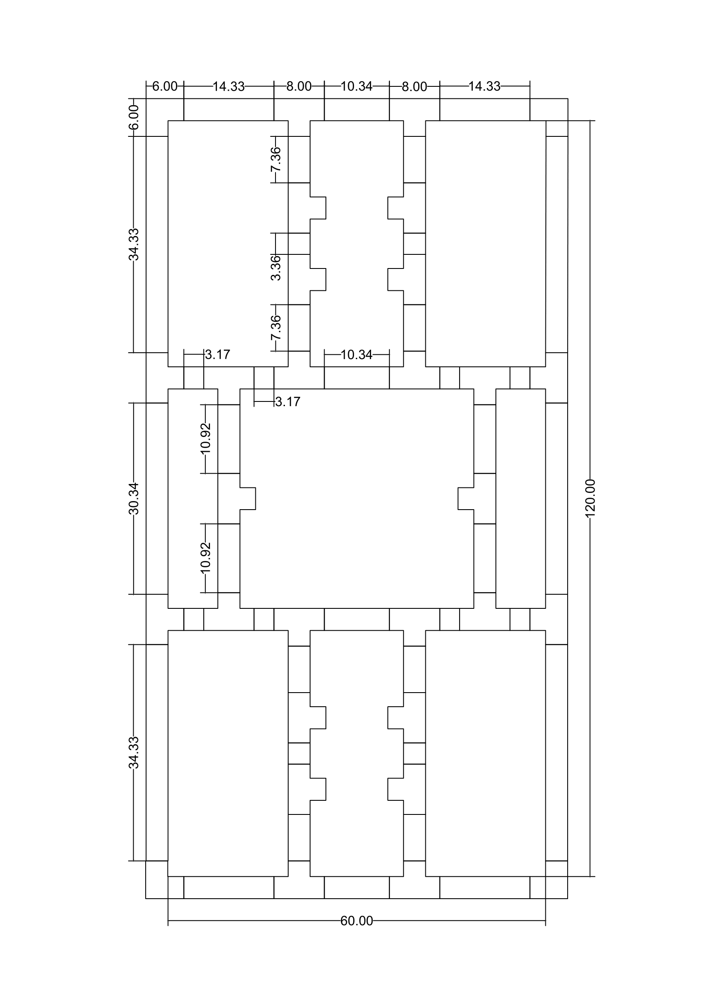

# Projeto PVC Robot


## Type Robot: Tracking and Exploration 
## Name Robot from Git: Brawler Yukon
### Comunidade: BigRobot  


```python
from IPython.display import Image
Image("pvcrobot1.jpeg")
```





### O que é ?
- PVC Robot é um projeto open-source(de codigo aberto) e open-hardware(de hardware aberto), ele consiste em um robo, simples de construir, basicamente feito de canos pvc com rodas e motores de carro de criança, como chassi, porém o foco é pensar em simular um carro autonomo com motores eletricos e direção controlado por atuador, com isso tornar simples e barato, é estudar e aplicar de forma real uso de frameworks e bibliotecas OpenCV, PySerial e PyLidar, pesando em como treinar de forma controlada um robo para dirigir sozinho, seguir rotas, processar esses dados em um computador de bordo.

### Como Funciona ?
(Lidar) Sensor Laser
(Kinect) Camera 
(Eletronica) 

Arduino Uno
1 modulo rele 4 canais
1 motores vidro eletrico
1 Arduino Uno
1 Intel Edson

(Software)

Flask, OpenCV, PySerial, pyutil, ROS, SimpleCV, Jupyter, QRCODE, PyLidar

(Funcionalidades)

* QRCODE DETECT
* LINE DETECT
* FACE DETECT
* WEB CONTROL


### Pra quem é destinado ?
000000000000

### Como deve ser usado ?
000000000

### Implementações Futuras ?
900000

## Processo de Montagem 
### Estruturação do Chassi para vizualização em escala explodida
OBs: TODAS AS PARTES POSSUEM MARCAÇÃO COM NUMERAÇÕES


```python
from IPython.display import Image
#Image("./chassi/20180514_215953.jpg")
Image("./chassi/20180514_215953.jpg")
```





###  Implementação das rodas e caixas de redução 


```python
Image("./chassi/20180514_195308.jpg")
```





### Desenho Tecnico em CAD para vizualização de medidas do Chassi 


```python
Image("./chassi/Brawler-Yukon-1.png")
```





### Etapa de Desenvolvimento do sistema de WebControl 
#### Os bibliotecas usadas foram
- PySerial
- Flask 
- time
--- 


```python
from flask import Flask
from flask import render_template, request,url_for
import serial
import time
```


```python


app = Flask(__name__, static_url_path='/static')

print "DOne"

try: 
  arduino = serial.Serial("/dev/ttyACM0",9600)
except: pass

```

    DOne


```python
@app.route("/")

def index():
    return render_template('robot.html')

@app.route('/left_side')
def left_side():
    data1="LEFT"
    arduino.write('a')
    time.sleep(0.5)
    arduino.write('p')
    print data1
    return 'true'

@app.route('/right_side')
def right_side():
   data1="RIGHT"
   arduino.write('d')
   time.sleep(0.5)
   arduino.write('p')
   print data1
   return 'true'

@app.route('/up_side')
def up_side():
   data1="FORWARD"
   arduino.write('w')
   arduino.write('p')
   print data1
   return 'true'

@app.route('/down_side')
def down_side():
   data1="BACK"    
   arduino.write('s')
   arduino.write('p')
   print data1
   return 'true'

@app.route('/stop')
def stop():
   data1="STOP"
   arduino.write('p')
   print data1
   return  'true'


```


```python
if __name__ == "__main__":
 print "Start"
 app.run(host='0.0.0.0',port=8080,debug=True)

```

    Start
     * Serving Flask app "__main__" (lazy loading)
     * Environment: production
       WARNING: Do not use the development server in a production environment.
       Use a production WSGI server instead.
     * Debug mode: on


     * Running on http://0.0.0.0:8080/ (Press CTRL+C to quit)
     * Restarting with stat


    An exception has occurred, use %tb to see the full traceback.


    SystemExit: 1


### HTML da Pagina 


```python
<html>
<head>
<style type="text/css">
        #conteudo{
            width: 500px;
            height: 350px;
            background-color: #ccc;
        }

        @media (max-width: 412px){
            body{
                background-color: lightgreen;
            }
            h1{
                color: black;
            }
            h2{
                color: pink;
            }
        }

        @media(min-width: 500px){
            body{
                background-color: black;
            }
            h1{
                color: yellow;
            }
            h2{
                color: blue;
            }
        }

        @media(min-width: 1000px){
            body{
                background-color: red;
            }
            h1{
                color: white;
            }
            h2{
                color: red;
            }
        }

        @media print{
            #conteudo{
                background-color: blue;
            }
        }

        @media only screen and(min-device-width: 320px) and (max-device-width: 568px){
            body{
                background-color: pink;
            }
        }


        @media only screen
            and(min-device-width: 731px)
            and(min-device-height: 411px)
            and(orientation: landscape)
            {
                body{
                    background-color: black;
                    color: white;
                }
            }
    </style><script src="https://ajax.googleapis.com/ajax/libs/jquery/3.1.1/jquery.min.js"></script>
</head>
<body>


<center><div id="conteudo">


<h1>PVC Robot</span></h1>


<h2>Intel Edson BreakBoard</h3><br>

  
<table>
    <h2> Controle </h2>
    <thead>
        <tr>
            <td> </td>
            <td><a href="#" id="up" style="font-size:30px;text-decoration:none;"><br>/\</a></td>
            <td> </td>
        </tr>
    </thead>
    <tbody>
        <tr>
            <td> <a href="#" id="left" style="font-size:30px;text-decoration:none;"><=</a> 
            </td>
            <td>   </td>
            <td> <a href="#" id="right" style="font-size:30px; text-decoration:none;">=></a> 
            </td>
        </tr>
        <tr>
            <td> </td>
            <td> <a href="#" id="down" style="font-size:30px;text-decoration:none;">\/<br></a>
            </td>
        </tr>
    </tbody>
  </table>


</div></center>

<script>
$( document ).ready(function(){
    $("#down").on("mousedown", function() {
     $.get('/down_side');
     }).on('mouseup', function() {
     $.get('/stop');
    });
    $("#up").on("mousedown", function() {
     $.get('/up_side');
     }).on('mouseup', function() {
     $.get('/stop');
    });
    $("#left").on("mousedown", function() {
     $.get('/left_side');
     }).on('mouseup', function() {
     $.get('/stop');
    });
    $("#right").on("mousedown", function() {
     $.get('/right_side');
     }).on('mouseup', function() {
     $.get('/stop');
    });
});
</script>

</body>
</html>

```
